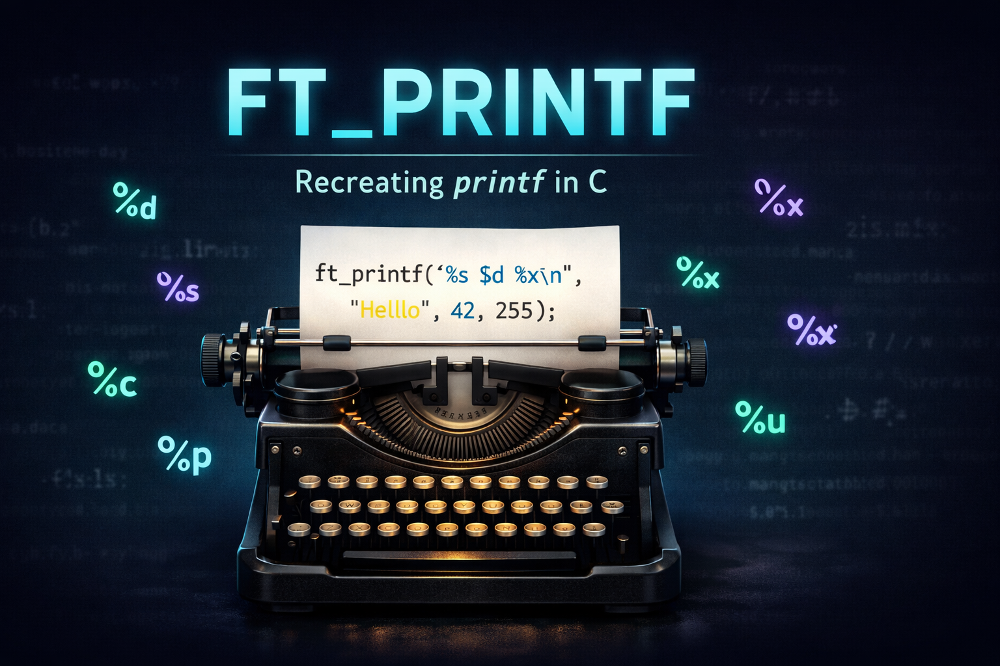
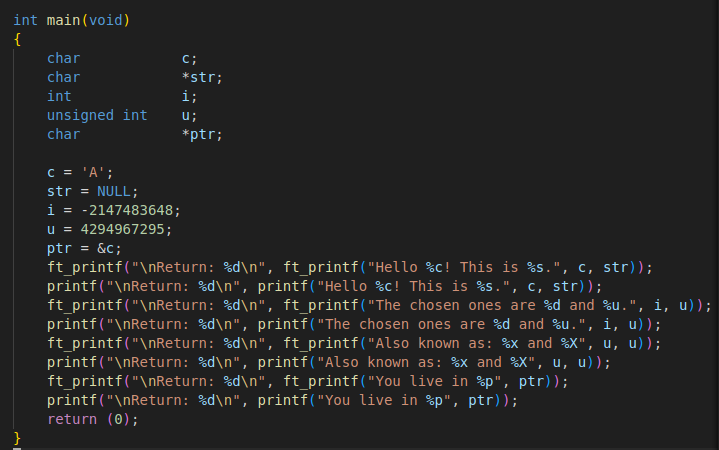
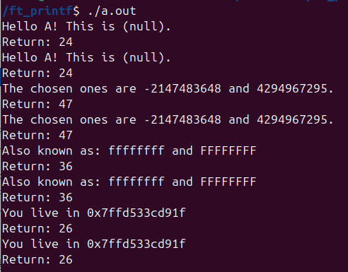

## Overview

`ft_printf` was built as part of the 42 curriculum to deepen low-level C programming skills through a practical systems-style challenge.

The project recreates key behavior of the standard `printf` family by handling variadic arguments, parsing conversion specifiers, and dispatching each value to dedicated output routines. This helps treat formatted output as an explicit, testable implementation rather than a black-box library call.

**Score: 100/100**

## Demo / Screenshots

This is a static library project, so there is no UI.

Main test file:



Terminal output:



## Tech Stack

- Language: C
- Build system: Make
- APIs and headers: `write`, `stdarg.h`, `unistd.h`
- Output artifact: static library (`libftprintf.a`)

## Architecture / Implementation

### Core Flow

1. Iterate through the format string in `ft_printf.c`.
2. Detect `%` tokens and validate supported conversions.
3. Pull the next argument from `va_list`.
4. Dispatch to conversion-specific helpers.
5. Return the total number of printed characters.

### Main Modules

- `ft_printf.c`: parser loop, specifier checks, and dispatcher.
- `ft_puttext.c`: `%c` and `%s` output helpers.
- `ft_putnumber.c`: signed/unsigned decimal printing (`%d`, `%i`, `%u`).
- `ft_puthex.c`: lowercase/uppercase hexadecimal conversion (`%x`, `%X`).
- `ft_putpointer.c`: pointer formatting with `0x` prefix (`%p`).
- `ft_printf.h`: public prototypes and shared includes.

### Key Technical Decisions

- Recursive conversion functions for integer, hex, and pointer output to keep logic compact and deterministic.
- Direct writes to stdout via `write` for full control over emitted bytes.
- Defensive handling of null values (`(null)` for strings and `(nil)` for pointers).

## Features

- Reimplementation of core `printf` behavior in pure C
- Variadic argument handling with `va_list` APIs
- Supported conversions: `%c`, `%s`, `%p`, `%d`, `%i`, `%u`, `%x`, `%X`, `%%`
- Accurate character-count return value for each call
- Modular source layout for easier maintenance and extension

## Getting Started

### Prerequisites

- GCC or Clang
- Make
- Linux or macOS environment

### Build the Library

1. Clone the repository:

```bash
git clone https://github.com/chilituna/ft_printf.git
cd ft_printf/ft_printf
```

2. Compile:

```bash
make
```

3. Optional cleanup targets:

```bash
make clean
make fclean
make re
```

### Use in Another C Project

Build the library first (from repository root):

```bash
make -C ft_printf
```

Then compile your file by linking the generated archive directly:

```c
#include "ft_printf.h"

int main(void)
{
    ft_printf("Hello %s! Number: %d, Hex: %X\n", "world", 42, 42);
    return (0);
}
```

```bash
cc main.c ./ft_printf/libftprintf.a -I./ft_printf -o program
```

## Project Structure

```text
.
├── README.md
└── ft_printf/
    ├── Makefile          # Build rules for libftprintf.a
    ├── ft_printf.h       # Public header and prototypes
    ├── ft_printf.c       # Main parser and dispatcher
    ├── ft_puttext.c      # Character and string output
    ├── ft_putnumber.c    # Signed and unsigned decimal output
    ├── ft_puthex.c       # Hexadecimal output helpers
    └── ft_putpointer.c   # Pointer address formatting
```

## Future Improvements

- Add automated tests that compare output and return values against libc `printf`
- Add CI to build and run tests on each push
- Extend support toward flags, width, and precision handling
- Add benchmark scripts to measure performance across conversions

## What I Learned

- Practical use of variadic functions (`va_start`, `va_arg`, `va_end`)
- Reliable format parsing and conversion dispatch design
- Recursive number conversion techniques in constrained C code
- Better handling of edge cases and output contract consistency


